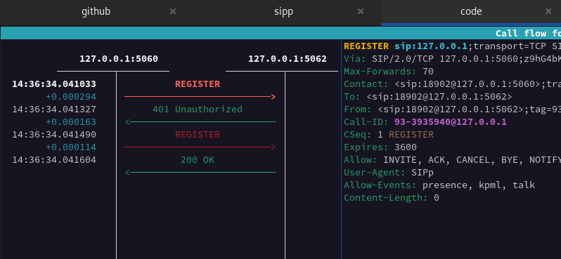
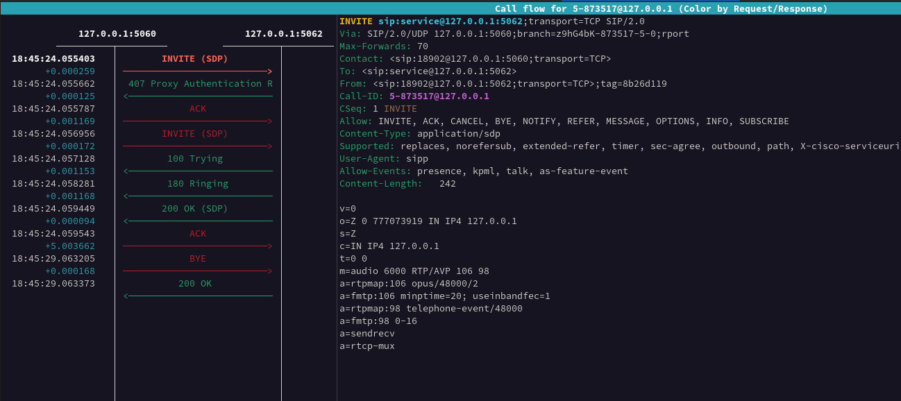

# SIPp helper

The SIPp helper is a collection of SIPp scenarios,short doc files and scripts designed to assist you in testing SIP platforms and other related components.

* [SIPp registrar](./doc/reg.md)
* [SIPp normal calls](./doc/nc.md)

## <u>SIPp registrar scenario - overview</u>

[**RFC 3665**]

2.1.  Successful New Registration
https://datatracker.ietf.org/doc/html/rfc3665.html#section-2.1

***

SIPp registrar scenario - sngrep screen

 

 

If you would like to use sipp in this case -
[**see more details**](./doc/reg.md)

## <u>SIPp normal call scenario - overview</u>

[**RFC 3665**]

3.2.  Session Establishment Through Two Proxies
https://datatracker.ietf.org/doc/html/rfc3665.html#section-3.2

***

SIPp normal call scenario - sngrep screen

 

 

If you would like to use sipp in this case -
[**see more details**](./doc/nc.md)

### <u>Useful links</u>:

https://github.com/SIPp/sipp

https://sipp.sourceforge.net/doc/reference.html

https://sipp.readthedocs.io/en/latest/

https://datatracker.ietf.org/doc/html/rfc3665.html