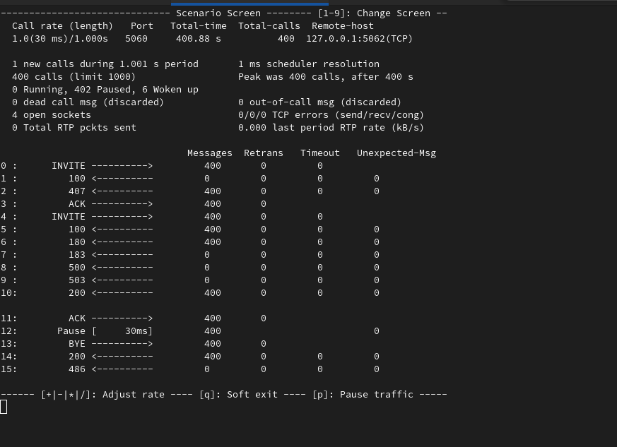
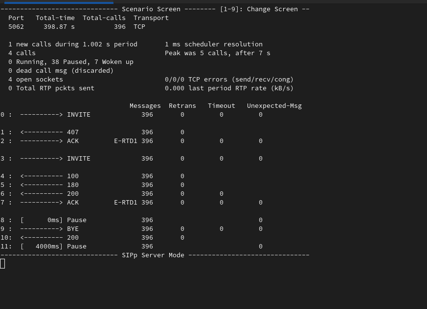

[**back**](../README.md)

## SIPp normal calls

* SIPp outgoing nc - UAC
* SIPp incoming nc - UAS

### <u>SIPp outgoing nc - UAC</u>

Start this command by CLI:

``` bash
sipp -sf xml/uac/Z_invite_v1.xml -inf csv/user.csv -t t1 127.0.0.1:5062 -r 1 -d 30 -l 1000
```


It's screen after sipp starting...



<br>

### <u>SIPp incoming nc - UAS</u>

Start this command by CLI:

``` bash
sipp -sf xml/uas/uas_nc_v1.xml -inf csv/user.csv -p 5062 -i 127.0.0.1 -t t4
```


It's screen after sipp starting...



<br>

[**back**](../README.md)
