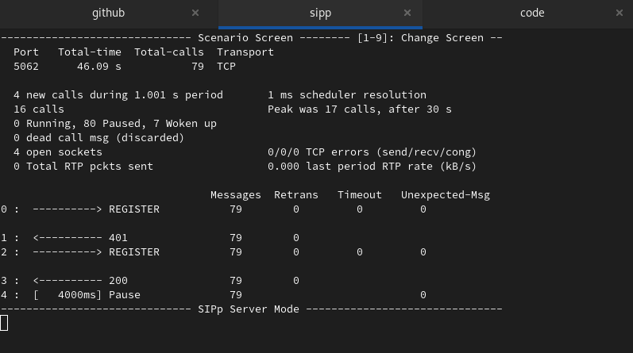

[**back**](../README.md)

## SIPp registrar

* SIPp registrar - UAS
* SIPp registrar - UAC

### <u>SIPp registrar - UAS</u>

Start this command by CLI:

``` bash
sipp -sf xml/uas/uas_reg.xml -inf csv/user.csv -p 5062 -i 127.0.0.1 -t t1
```


It's screen after sipp starting...




### <u>SIPp registrar - UAC</u>


If you would like to test some SIP server,in SIP registrar role,then you can use this scenario.

Start this command by CLI:

``` bash 
sipp -sf xml/uac/register.xml -inf user.csv -t t1 127.0.0.1:5062 -r 4 -trace_err
```

It's screen after sipp starting...


<br>

[**back**](../README.md)
